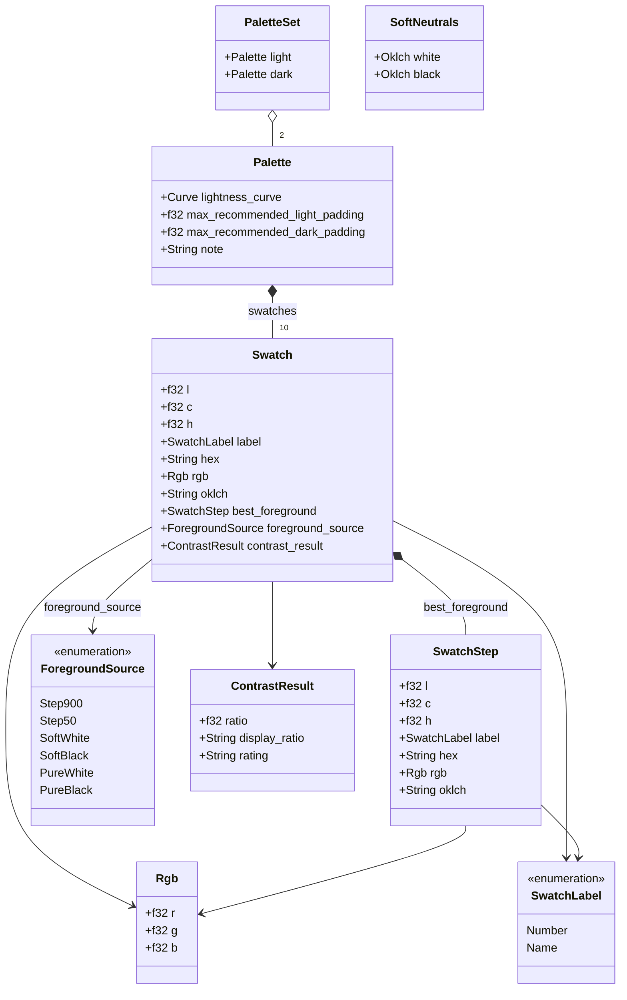

# Harmoni architecture history

Four refactoring steps were executed in order C → D → A → B. All
shipped in PRs #1 and #2.

## Step C — ColorInput abstraction

One enum is the only way to hand colours to the engine. Lives in
`crates/harmoni-core/src/color/input.rs`:

```rust
pub enum ColorInput {
    Css(String),            // parsed via csscolorparser
    Rgb { r: u8, g: u8, b: u8 },
    Hsl { h: f32, s: f32, l: f32 },
    Oklch { l: f32, c: f32, h: f32 },
}

pub enum ColorInputError {
    InvalidCss(String),
}
```

All variants normalise to `palette::Oklch`, which is the internal
canonical form. `Css` covers hex, `oklch(...)`, `rgb(...)`, named
colours — anything `csscolorparser` accepts.

There is exactly one parsing path. Before this step there were three
(`audit::contrast::parse_oklch_string`, the wasm crate's hex dance,
ad-hoc hex parsing); they were consolidated here.

The enum variant was initially `Hex` (first shape wired up) and
renamed to `Css` in a dedicated refactor commit once it became clear
it accepted arbitrary CSS.

## Step D — curated `api` module

`crates/harmoni-core/src/api/` is the adapter-facing surface.
Adapters import from `harmoni_core::api`, never from lower-level
modules and never from the `palette` crate directly.

```rust
pub use audit::audit_contrast;
pub use generate::{generate, generate_with_options, GenerateOptions};
pub use crate::palette::generator::generate_greyscale_oklch as generate_greyscale;
```

- `generate_with_options` takes `GenerateOptions { light_padding,
  dark_padding }`. `generate` is a thin wrapper with defaults.
- `audit_contrast` is fallible because it accepts arbitrary CSS.
- `generate_greyscale` is intentionally infallible — no user input
  means nothing to validate. The workbench calls it directly.
- The module-and-function name collision (`api::generate` is both a
  module and a re-exported function) is intentional — same pattern
  as `std::mem::size_of`.

## Step A — harmoni-core is pure Rust

`wasm-bindgen` and `tsify` are **gone** from `harmoni-core`.
`crates/harmoni-core/Cargo.toml` has three direct deps only:
`csscolorparser`, `palette`, `serde`.

Tsify/wasm-abi work moved to `crates/harmoni-wasm/src/types.rs`,
which holds mirror types that shadow the core structs
field-for-field (`SwatchLabel`, `SwatchStep`, `ContrastResult`,
`Swatch`) and derive `Tsify`. Each has `From<harmoni_core::*>` so
wasm entry points convert at the boundary:

```rust
api::audit_contrast(...)
    .map(Into::into)     // harmoni_core::ContrastResult → types::ContrastResult
    .map_err(to_js_error)
```

An opaque `Palette` extern type is used because `Vec<T>` isn't a
first-class wasm-abi return type. A `typescript_custom_section`
emits `export type Palette = Swatch[]` so the TS side gets a named
type alias matching the engine's vocabulary:

```rust
#[wasm_bindgen(typescript_custom_section)]
const TS_PALETTE: &'static str = r#"
export type Palette = Swatch[];
"#;

#[wasm_bindgen]
extern "C" {
    #[wasm_bindgen(typescript_type = "Palette")]
    pub type Palette;
}
```

The TypeScript type `Swatch` in the generated `.d.ts` comes from
Tsify's `typescript_custom_section` emission on `types::Swatch`.
The workbench's `import { type Palette } from "harmoni-wasm"` still
resolves because the emitted type name is identical.

> Superseded — see *Palette became a struct* below. `Palette` is
> now a struct on both sides; the `export type Palette = Swatch[]`
> custom section is gone, and `types::Palette` carries a `Tsify`
> derive that emits a struct interface.

## Step B — rename

`primitiv-core` → `harmoni-core`, `primitiv-wasm` → `harmoni-wasm`.
Everything Rust, tooling, and JS/TS now says `harmoni` except the
deliberate product-name references: `README.md` heading,
`package.json` name, `apps/workbench/index.html` title,
`apps/workbench/src/App.tsx` `<h1>`.

If you find yourself renaming any of those, stop — you're eroding
the identity split between *Primitiv* (the product) and *Harmoni*
(the engine code name) established during Step B.

## Vocabulary rename (post-Step B)

Domain types were aligned with design-system language:

- `OklchStep` → `SwatchStep` — a single colour point with l/c/h and
  a label.
- `OklchLabel` → `SwatchLabel` — the discriminated label on a step
  (either a numeric scale position like `500` or a name like
  `"White"`).
- The struct formerly called `Palette` → `Swatch` — one item on a
  lightness scale, carrying its foreground recommendation and
  contrast metadata.
- `pub type Palette = Vec<Swatch>` — type alias so the whole scale
  has a name. Generator return types simplified from `Vec<Palette>`
  to `Palette`.

The wasm mirror types (`types.rs`) and the workbench's TypeScript
were updated mechanically. `Swatch.tsx` in the workbench aliases the
import as `SwatchData` to avoid colliding with the React component
name.

## Palette became a struct

`Palette` was promoted from a `Vec<Swatch>` type alias to a struct:

```rust
pub struct Palette {
    pub swatches: Vec<Swatch>,
    pub lightness_curve: [f32; 10],
    pub max_recommended_light_padding: f32,
    pub max_recommended_dark_padding: f32,
    pub note: String,
}
```

The `max_recommended_*` and `note` metadata — once duplicated on
every `Swatch` — now live on the palette, where they belong (one
value per palette, not per swatch). The wasm `types::Palette`
mirrors it as a `Tsify` struct.

## Neutral colour handling (post-vocabulary-rename)

A `neutral` module gives `harmoni-core` first-class greyscale /
neutral ramps. Landed across PRs #56–#58.

`crates/harmoni-core/src/neutral/` has three parts:

- `derive::derive_soft_neutrals(brand, softness)` → `SoftNeutrals`
  — soft black/white primitives derived from a brand colour. The
  softness factor (clamped `[0, 1]`) controls how far the endpoints
  pull off pure white/black and how much brand tint they carry.
- `ramp::generate_neutral_ramp(white, black, TintMode)` → `Palette`
  — a 10-step ramp interpolated between the two endpoints along the
  normalised perceptual lightness curve. `TintMode::Inherit` lets the
  mid-steps inherit the endpoints' chroma; `TintMode::Achromatic`
  forces chroma to 0 at every step.
- `tint::tint_neutrals(white, black, source, strength)` →
  `SoftNeutrals` — layers `source`'s hue onto already-chosen white
  and black, **keeping their lightness**. This is the
  layer-a-tint-onto-my-tones operation; it does not derive new
  lightnesses the way `derive_soft_neutrals` does.

`SoftNeutrals { white, black }` (a pair of `palette::Oklch`) and
`TintMode` are re-exported from the crate root. The `api` wrappers
(`api::generate_neutral_ramp`, `api::derive_soft_neutrals`,
`api::tint_neutrals`) take `ColorInput`.

The standalone `generate_greyscale_oklch` / `api::generate_greyscale`
from Step D was **removed** — the `neutral` module supersedes it.

### Foreground audit + GenerateOptions

`GenerateOptions` gained `soft_white` / `soft_black`
(`Option<Oklch>`): when set they replace pure white/black as
foreground-audit candidates, so a brand palette can use the design
system's soft primitives.

`get_best_foreground` became a six-tier audit, in preference order:
harmonious dark (step 900) → harmonious light (step 50) → soft white
→ soft black → pure white → pure black. Pure white/black are always
evaluated last and mathematically guarantee an AA-passing result for
any sRGB background.

### wasm mirror types added

`types.rs` gained `TintMode`, `SoftNeutrals`, and `OklchTriple`.
`OklchTriple` is a wasm-only `{ l, c, h }` flattening — the wasm
crate can't expose `palette::Oklch` directly. `TintMode` has `From`
impls in *both* directions because it is passed into the engine, not
just returned.

### Foreground source discriminant (RFC 0003)

`get_best_foreground` now also returns a `ForegroundSource` enum
(`Step900 · Step50 · SoftWhite · SoftBlack · PureWhite · PureBlack`)
naming which of the six tiers won — it replaced the old
`is_harmonious` bool. Every `Swatch` carries it as `foreground_source`
alongside the resolved `best_foreground`, so a consumer can re-express
the choice as a token alias (the ramp's own 50/900, or a white/black
anchor) rather than a baked colour. Mirrored on the wasm `Swatch`.

## API surface at a glance

The settled public shape, as UML. Source lives in the crate root —
`crates/harmoni-core/api-surface.mmd` (entry points + inputs) and
`crates/harmoni-core/data-model.mmd` (the data model below). Same
capabilities reach Rust adapters via `harmoni_core::api` and TS/JS via
the `harmoni_wasm` `#[wasm_bindgen]` wrapper.


